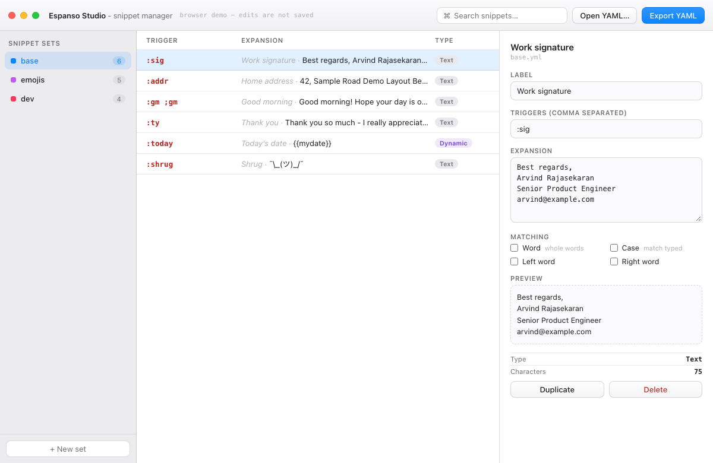

# Espanso Studio

A Typinator-style manager for [espanso](https://espanso.org), the open-source
text expander. Espanso's engine is excellent, but snippets are managed by
hand-editing YAML. Espanso Studio is a **companion app** for macOS and Windows:
it reads and writes espanso's live config files, and espanso picks up every
change automatically (its built-in file watcher + auto-restart).



## What it does

- Discovers your real snippet sets from espanso's config directory
  (macOS: `~/Library/Application Support/espanso/match`, Windows: `%APPDATA%\espanso\match`,
  legacy `~/Library/Preferences/espanso` on Macs that still use it - same resolution as espanso itself)
- Every espanso v2 match kind: `trigger`/`triggers`, `regex`, `replace`, `markdown`, `html`,
  `form`/`form_fields`, `image_path`, `vars` (date/clipboard/shell), `label`, `search_terms`
- Edit label, triggers, expansion, and matching options (`word`, `left_word`,
  `right_word`, `propagate_case`) with live preview
- Search, add (Cmd/Ctrl+Enter), duplicate, delete; create new sets
- Autosaves to disk (desktop app), export YAML for sharing
- Shows a warning banner if a set's YAML on disk is currently invalid

## Safety

- YAML is validated before every write - invalid content never touches the live config
- Writes are atomic (temp file + rename) so espanso's watcher never sees a half-written file
- One-level `.bak` backup of each file before overwrite
- Path guard: the app refuses to write outside the espanso match directory
- Core file logic is pure Rust, unit-tested (`npm test` = `cargo test`, 3 tests passing)

## Stack

Tauri v2 (Rust core + webview UI), one codebase for macOS (.dmg) and Windows (.msi/nsis).
The UI (`ui/index.html`) is a zero-build single file with js-yaml inlined; it runs as a
browser demo when opened directly (edits not saved) and talks to the Rust backend when
running inside Tauri.

## Build

```
npm install          # installs @tauri-apps/cli
npm run icon -- <source.png>   # generates src-tauri/icons/* (required before build)
npm run dev          # run locally
npm run build        # produces .dmg (macOS) / .msi+.nsis (Windows)
```

Windows builds require building on Windows (or CI); same for macOS.
GPL-3.0 is not required for this companion app (it does not link espanso code),
but sharing credit and schema compatibility with espanso is intended.

## Layout

- `src-tauri/src/store.rs` - config discovery, read/write, validation (pure, tested)
- `src-tauri/src/main.rs` - thin Tauri command layer
- `ui/index.html` - the whole frontend
- `prototype/index.html` - the original browser prototype

## Roadmap

- Form builder UI and variable picker (date/clipboard/shell)
- Package browser for espanso hub
- Settings pane for `config/*.yml` (toggle key, search shortcut, backend)
- File-watch push events (currently reloads on window focus)
- App icon + notarized release builds
